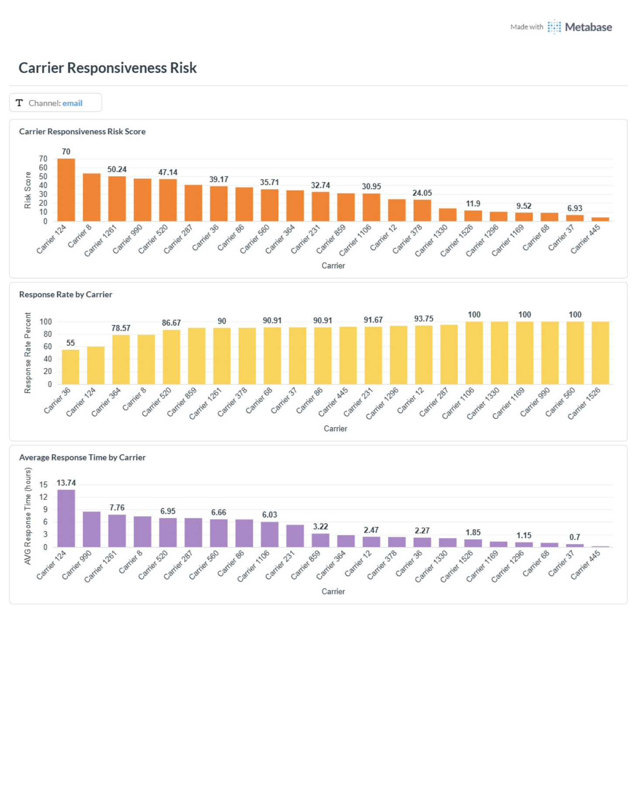

# Metabase - Carrier Responsiveness Risk

This folder contains the exported Metabase dashboard for the FreightHero Carrier Profile assessment.

## Dashboard Files

- `Metabase - Carrier Responsiveness Risk.pdf` - dashboard screenshot
- `carrier-responsiveness-risk-dashboard.png` - dashboard screenshot



## Data Source

Metabase reads the final Gold table:

```text
public.carrier_risk
```

When Metabase runs inside Docker, configure the PostgreSQL connection with:

```text
Display name: FreightHero
Host: postgres
Port: 5432
Database: freighthero
Username: postgres
Password: the value configured in .env
SSL: off for the local environment
```

The Gold notebook runs on the host and uses `localhost:5432`. Metabase runs inside the Docker network and therefore uses `postgres:5432`.

## Dashboard Cards

The dashboard contains three cards:

1. Carrier Responsiveness Risk Score - prioritizes carriers for investigation
2. Response Rate by Carrier - explains whether non-response drives the risk
3. Average Response Time by Carrier - explains whether slow responses drive the risk

The Risk Score card is the prioritization view. The response-rate and response-time cards are the two diagnostic views.

## Query 1 - Carrier Responsiveness Risk Score

```sql
WITH carrier_metrics AS (
    SELECT
        carrier_name,
        COUNT(*) AS total_records,
        COUNT(*) FILTER (WHERE responsed = TRUE) AS responded_records,
        COUNT(*) FILTER (WHERE responsed = FALSE) AS unanswered_records,
        COUNT(*) FILTER (WHERE responsed = TRUE)::numeric
            / NULLIF(COUNT(*), 0) AS response_rate,
        AVG(response_time) FILTER (
            WHERE responsed = TRUE
                AND response_time IS NOT NULL
        ) / 60.0 AS avg_response_time_hours
    FROM public.carrier_risk
    WHERE carrier_name IS NOT NULL
        [[AND channel = {{channel}}]]
    GROUP BY carrier_name
    HAVING COUNT(*) >= 10
),
delay_ranking AS (
    SELECT
        carrier_name,
        PERCENT_RANK() OVER (
            ORDER BY avg_response_time_hours ASC
        ) AS delay_risk
    FROM carrier_metrics
    WHERE responded_records > 0
        AND avg_response_time_hours IS NOT NULL
),
score_components AS (
    SELECT
        metrics.carrier_name,
        metrics.total_records,
        metrics.responded_records,
        metrics.unanswered_records,
        metrics.response_rate,
        metrics.avg_response_time_hours,
        1.0 - metrics.response_rate AS non_response_risk,
        COALESCE(delay.delay_risk::numeric, 1.0) AS delay_risk,
        CASE
            WHEN metrics.responded_records = 0 THEN 1.0
            ELSE
                0.50 * (1.0 - metrics.response_rate)
                + 0.50 * COALESCE(delay.delay_risk::numeric, 1.0)
        END AS risk_score_ratio
    FROM carrier_metrics AS metrics
    LEFT JOIN delay_ranking AS delay
        ON metrics.carrier_name = delay.carrier_name
),
scored_carriers AS (
    SELECT
        carrier_name,
        total_records,
        responded_records,
        unanswered_records,
        ROUND(response_rate * 100.0, 2) AS response_rate_percent,
        ROUND(
            avg_response_time_hours::numeric,
            2
        ) AS avg_response_time_hours,
        ROUND(
            non_response_risk * 100.0,
            2
        ) AS non_response_risk_percent,
        ROUND(
            delay_risk * 100.0,
            2
        ) AS delay_risk_percent,
        ROUND(
            risk_score_ratio * 100.0,
            2
        ) AS risk_score
    FROM score_components
)
SELECT
    carrier_name,
    total_records,
    responded_records,
    unanswered_records,
    response_rate_percent,
    avg_response_time_hours,
    non_response_risk_percent,
    delay_risk_percent,
    risk_score,
    CASE
        WHEN risk_score >= 66.67 THEN 'High'
        WHEN risk_score >= 33.33 THEN 'Medium'
        ELSE 'Low'
    END AS risk_level
FROM scored_carriers
ORDER BY
    risk_score DESC,
    total_records DESC;
```

### Risk Score definition

```text
Risk Score = 100 × (
    0.50 × (1 - response rate)
    + 0.50 × response-delay percentile
)
```

- `PERCENT_RANK()` positions a carrier's average response time relative to the other eligible carriers.
- Higher response times receive higher delay risk.
- Carriers with no responses receive the maximum score of `100`.
- Only carriers with at least 10 response-cycle records within the selected channel are included.
- The 50/50 weighting, minimum sample, and risk-level thresholds are analytical assumptions pending stakeholder approval.

### Chart configuration

- Visualization: bar chart
- Category/X-axis: `carrier_name`
- Value/Y-axis: `risk_score`
- Sort: `risk_score` descending
- Axis range: 0 to 100
- Data labels: enabled
- Suggested colors: orange for the Risk Score

## Query 2 - Response Rate by Carrier

```sql
SELECT
    carrier_name,
    COUNT(*) AS total_records,
    COUNT(*) FILTER (WHERE responsed = TRUE) AS responded_records,
    ROUND(
        100.0 * COUNT(*) FILTER (WHERE responsed = TRUE)
        / NULLIF(COUNT(*), 0),
        2
    ) AS response_rate_percent
FROM public.carrier_risk
WHERE carrier_name IS NOT NULL
    [[AND channel = {{channel}}]]
GROUP BY carrier_name
HAVING COUNT(*) >= 10
ORDER BY response_rate_percent ASC;
```

### Chart configuration

- Visualization: bar chart
- Category/X-axis: `carrier_name`
- Value/Y-axis: `response_rate_percent`
- Sort: `response_rate_percent` ascending
- Axis range: 0 to 100
- Number format: percentage
- Data labels: enabled
- Suggested colors: yellow for response rate

## Query 3 - Average Response Time by Carrier

```sql
SELECT
    carrier_name,
    COUNT(*) FILTER (WHERE responsed = TRUE) AS responded_records,
    ROUND(
        (
            AVG(response_time) FILTER (
                WHERE responsed = TRUE
                    AND response_time IS NOT NULL
            )
        )::numeric / 60.0,
        2
    ) AS avg_response_time_hours
FROM public.carrier_risk
WHERE carrier_name IS NOT NULL
    [[AND channel = {{channel}}]]
GROUP BY carrier_name
HAVING COUNT(*) >= 10
    AND COUNT(*) FILTER (WHERE responsed = TRUE) > 0
ORDER BY avg_response_time_hours DESC;
```

### Chart configuration

- Visualization: bar chart
- Category/X-axis: `carrier_name`
- Value/Y-axis: `avg_response_time_hours`
- Sort: `avg_response_time_hours` descending
- Unit: hours
- Data labels: enabled
- Suggested colors: purple for average response time

## Channel Filter Setup

Each native SQL question uses this optional Metabase variable:

```sql
[[AND channel = {{channel}}]]
```

Configure it as follows:

1. Open each question in the SQL editor.
2. Open the variable settings for `channel`.
3. Set the variable type to **Text**.
4. Save the question.
5. Add one dashboard-level filter named **Channel**.
6. Use a Text/Category filter and connect it to the `channel` variable on all three cards.
7. Set `email` as the current dashboard value.

The current Gold result is effectively email-only because its outbound rule requires `status = delivered`. SMS primarily uses `sent`, and chat requires separate status/contact rules. SMS and chat should only be exposed after those business rules are implemented and validated.

## Permissions and Metadata

For a production-style setup:

- Use a dedicated read-only PostgreSQL user for Metabase.
- Grant that user `SELECT` only on the Gold schema/tables required by BI.
- Place the questions and dashboard in a controlled Metabase collection.
- Give operations users view access and limit query/dashboard editing to analysts or administrators.
- Add human-readable descriptions for `responsed`, `response_time`, and the Risk Score fields.
- Sync the PostgreSQL schema in Metabase after the Gold table is first created or replaced.

No additional Metabase plugin is required for the PostgreSQL connection because PostgreSQL support is built in.

## Interpretation

The Risk Score is a communication-responsiveness prioritization signal. It helps operations decide which carriers to investigate first and whether the driver is missing responses, slow responses, or both. It is not a complete carrier safety, financial, fraud, or delivery-risk score.